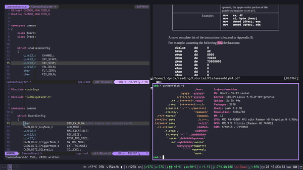
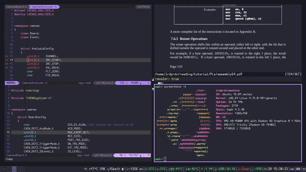

# my-config

## Description
This repo contains config-files and script I use.

## Colors
All the colors (if specified by myself) are taken from [dracula theme for VIM](https://github.com/dracula/vim).

## Results 

  
  
  

